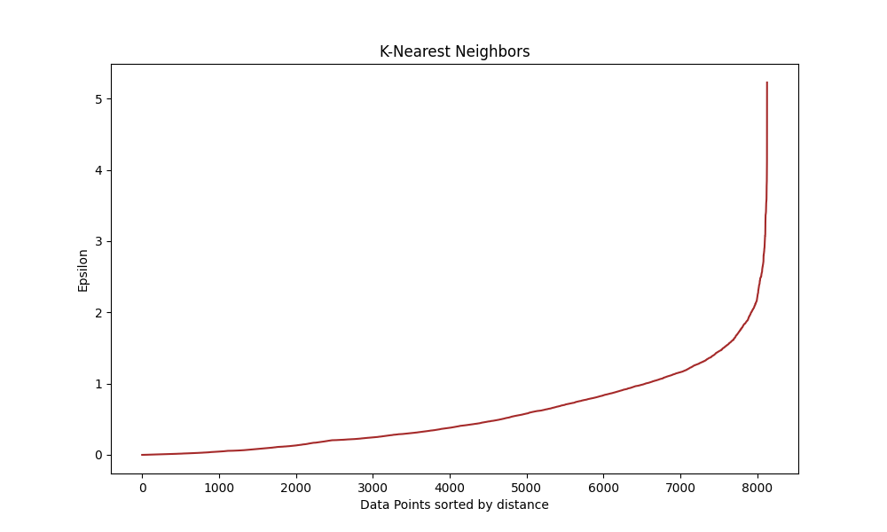

# ShopEasy AI Model

## Team Members
- Gianfranco Pizzuto 281481
- Petar Jelusic 286581
- Santiago Cuesta 289581

## Section 1: Introduction
In this project, we analyze data from ShopEasy, a leading e-commerce platform offering a wide range of products. The goal is to uncover hidden patterns in customer behavior to enhance personalized user experiences, special promotions, and services. By performing exploratory data analysis (EDA) and preprocessing the dataset, we aim to segment customers based on their buying habits and behaviors.

We begin with EDA, checking for missing values and duplicates, and then clean the data by dropping unnecessary columns and handling outliers. We use visualization techniques to understand data distributions and relationships between variables. 

After preprocessing, we determine that this is a clustering problem and test two different clustering models: K-means++ and DBSCAN. We use the Elbow Method and Silhouette Score to identify the optimal number of clusters, ensuring meaningful and manageable segments.

For each identified segment, we analyze and describe the properties and behaviors of the customers, providing insights that can help ShopEasy offer a more personalized shopping experience. Through this project, we aim to transform raw data into actionable insights, enhancing customer satisfaction and engagement on the platform.

---

**Setup Instructions**
To recreate the environment used for this project, follow these steps:
1. **Clone the Repository:**
   ```sh
   git clone https://github.com/gpizzutoa/ShopEasy_281481.git
   cd your-repo-directory
   ```
2. **Create and Activate Conda Environment:**
   Using `requirements.txt`:
   ```sh
   conda create --name myenv --file requirements.txt
   conda activate myenv
   ```

## Section 2: Methods (**EDA & Data Pre-Processing**)


### **1. Visualizing and Understanding Data Structure & Values**

#### a) Checking Data Integrity

First, we examined the dataset for missing values to ensure its completeness, checking for missing values and duplicates.

**Observations:**
- **Columns with Missing Data**:
  - `maxSpendLimit`: Only 1 missing value (0.01% of the total), which is negligible.
  - `leastAmountPaid`: 313 missing values (3.50% of the total). This higher percentage might still not significantly impact our analysis of payment behavior.
  - **Overall Data Completeness**: Most columns have a very low percentage of missing values or none at all, because of the low percentage we will drop those columns. We also observed there where no duplicates.

#### b) Dropping Unnecessary Values & Columns

  - We removed the `personId` column since it's a primary key and not relevant for our analysis.
  -  We dropped rows that had any missing values across the DataFrame (after removing `personId`).

- This resulted in a new, clean DataFrame which we referred to as `ndf`.
- After cleaning, we re-checked for missing values to confirm that no missing data remained. All was good!

#### c) Describing the New DataFrame

We then summarized the new DataFrame to understand the distribution and range of values in each column.

*Observations:* `leastAmountPaid` having a maximum value greater than the `itemCosts` suggest potential errors or outliers in the data, which requires further investigation to ensure accuracy in the data analysis.

### **2. Univariate Analysis**

#### a) Distribution Graph
We began by examining the distribution of individual variables within the DataFrame to understand their spread and identify any potential skewness or outliers.


**Observations from the Data:**
- **Right-Skewed Distributions**: `accountTotal`, `itemCosts`, `maxSpendLimit`
- **Left-Skewed Distributions**: `frequencyIndex`, `accountLifespan`
- **Bimodal Distribution**: `itemBuyFrequency`
- **Uniform Distribution**: `webUsage`

#### b) Box Plots

To identify and analyze outliers, we utilized box plots for various features.


**Observations from Box Plots:**
- **High Variation**:
  - Many box plots exhibited a significant number of outliers.
  - These outliers indicate substantial variation within certain features.
  - 

### **3. Bivariate Analysis**

Next we aimed to examine relationships between pairs of variables with similar values from the box plots to understand their interactions better.

#### a) Analysis of Pairs Analyzed

- **itemCosts and singleItemCosts**
- **itemBuyFrequency and multipleItemBuyFrequency**

**Anomalies**
- **leastAmountPaid**: In the box plots outliers reach values around 80,000, which is significantly higher than the highest values in `monthlyPaid` or `accountTotal`.

- **monthlyPaid**: The description "Total amount paid by the user every month" is vague. It is unclear whether this refers to a fixed amount or an average.

#### b) ScatterPlot & Correlation
To further investigate any missed relationships or anomalies, we will conduct a multivariate analysis.

##### - itemBuyFrequency vs. multipleItemBuyFrequency


We observed a strong positive relationship between **itemBuyFrequency** (frequency of items purchased) and **multipleItemBuyFrequency** (frequency of items bought in installments). 

- The correlation is very strong at 0.86.
  - This suggests that users frequently opt for multiple installments, aligning closely with the overall buying frequency.
  - Frequent installment purchases contribute to the strong correlation.


##### - itemCosts vs. singleItemCosts


We observed a strong positive relationship between **itemCosts** (total costs of items purchased) and **singleItemCosts** (costs of items bought in a single purchase).

- The correlation is very strong at 0.92.
- This suggests that single purchases tend to have higher values compared to multiple installment purchases, contributing to the strong correlation.

**ANOMALY IN COMPARISON:**
We observed that numerous users have values for `leastAmountPaid` that are higher than the values for `accountTotal`, which should not be possible. This discrepancy suggests an inconsistency in the data that needs to be addressed to ensure accurate analysis.

#### c) Using Categorical Values

We now analyzed the `location` and `accountType` to determine if there is a predominant category. Both categories appeared to have an equal distribution.

#### d) KDE (Kernel Density Estimate)


The KDE plots indicated that the distribution of itemBuyFrequency is similar across different account types and locations. This suggests that neither accountType nor location significantly affects the distribution of other features.

Based on this observation, we determined that the location feature might not be relevant for understanding customer buying habits and behavior. In an e-commerce context, where most transactions occur online, the customer's physical location is less significant.

#### e) PairPlot with accountType

We used a pair plot to investigate the potential correlation between accountType and other key features that might influence customer buying habits and behavior. 


Using the pair plot, we could not visualize a clear correlation between `accountType` and any other variable.

### 4. Label Encoding

We applied label encoding to `accountType` because it can be considered ordinal, where the order of categories is meaningful.

  - **Premium** `0`: Pays the most.
  - **Regular** `1`: Pays a standard amount.
  - **Student** `2`: Pays the least due to discounts.

This encoding reflects the hierarchy of payment amounts among different account types.

**Encoding for location**
 Since location values are nominal, meaning they have no inherent order. We used dummy variables, where each category is represented by a binary vector.

### **5. Correlation Heatmap**

Using this heatmap, we'll visualize the correlation between all attributes to observe any correlations that we might have missed.


- **Irrelevant or Redundant Features (To Be Dropped)**:
  - **Location**: No correlation with other attributes.
  - **accountTotal**: Inconsistent values compared to `itemCosts` and `monthlyPaid`.
  - **leastAmountPaid**: No correlation with other features; inconsistent with `monthlyPaid`.
  - **monthlyPaid**: Inconsistencies with `itemCosts`; no additional insights.
  - **webUsage** and **frequencyIndex**: Little correlation; similar to `itemBuyFrequency`.
  - **paymentCompletionRate**: Lack of correlation; no significant insights.
  - **maxSpendLimit**: Inconsistent with `singleItemCosts`; conflicting definition.
  - **itemBuyFrequency**: Specific versions `singleItemBuyFrequency`, `multipleItemBuyFrequency`.
  - **itemCosts**: Specific versions `singleItemCosts` and `multipleItemCosts`.
  - **emergencyUseFrequency**: High correlation with `emergencyCount`; redundant.

- **Account Type**:
  - Relevant despite no correlation with other features

### **6. Dropping Values**

We created a new variable, Final Data Frame (`fdf`), in which we dropped all the columns listed above.

### **7. Removing Outliers**

To address outliers, we removed values that are more than 4 standard deviations from the mean. Below, we identify and remove these outliers, ensuring we don't lose too much data.
- **Outliers Removed**: The number of rows removed is 536, which is relatively small and can be considered negligible. Therefore, we proceed with the removal process.

### **8. Data Scaling**

Since the attribute values have significantly different ranges, we scaled the data as a general practice to normalize the data.

### **9. Correlation Heatmap for Cleaned & Scaled Data Frame**

After cleaning and scaling the data, we generated a new correlation heatmap to ensure the data is now ready for further analysis.


---

### **Why is this is a Clustering Problem**

- **Data Characteristics**:
  - The dataset includes both numerical and categorical data, ideal for segmentation and clustering.

- **Not Regression**:
  - Regression predicts continuous outcomes, which is not the focus here.

- **Not Classification**:
  - Classification involves supervised learning with predefined categorical outcomes. Our goal is to uncover clusters, not use predefined ones.

- **Clustering Approach**:
  - Clustering is used in unsupervised learning to discover patterns and group customers into clusters without predefined outcomes.

The objective is to identify natural groupings within the data to enhance the user experience through personalized recommendations.

---
## Section 3: Experimental Design ( **K-Means++**)
### Purpose (Why is K-means++ Good for This Problem?)
- **Better Initialization:** Ensures initial centroids are spread out, reducing poor initialization that could lead to suboptimal results.
- **Faster Convergence:** With better initial centroids, K-means++ often converges faster than standard K-means, reducing the number of iterations required.
- **Improved Clustering Quality:** Increases the likelihood of finding clusters that better represent the inherent structure of the data.

For our analysis on customer purchasing behavior, K-means++ is beneficial because it helps identify distinct customer segments more accurately, reduces variability in clustering results, and enhances the performance and efficiency of the clustering process, making it suitable for large datasets.

### Baselines
We compared the K-means++ clustering results with the standard K-means clustering algorithm. The comparison focused on initialization quality, convergence speed, and clustering accuracy.

### Evaluation Metrics
##### a) **Elbow Method**
**Purpose**: To determine the ideal number of clusters for K-means clustering.
**Inertia**: Measures the within-cluster sum of squares. Inertia decreases as the number of clusters increases.

**Procedure**:
- Run K-means with different numbers of clusters (k).
- Plot inertia (y-axis) against the number of clusters (x-axis).
- Identify the "elbow point" where inertia starts to decrease more slowly, indicating the optimal number of clusters. 


This method suggests a cluster number of 3 or 4 based on the graph.

##### b) **Silhouette Score**
- **Usage**: Determines the appropriate number of clusters, considering the graph.
- **Function**: Measures how similar an object is to its own cluster compared to other clusters.
- **Importance**: Helps in identifying distinct clusters and minimizing overlap.
  
*K-Means Silhouette Score (4 clusters): 0.23*
*K-Means Silhouette Score (3 clusters): 0.27*

Using 3 clusters is significantly better than 4. We do not expect a large score because it is less relevant in a clustering problem such as this one.

**Rationale**:
- **Customer Segmentation**: Identifies general customer types, making the elbow method practical.
- **Complex Data**: Using the Silhouette score alone might suggest more clusters than necessary, leading to overfitting and making clusters less interpretable.
- **Insightful Analysis**: Both methods combined provide a balanced approach, ensuring meaningful and manageable clusters without focusing on subtle, non-essential differences in complex, high-dimensional data. Because of this, we will use `3` clusters.

## Section 4: Results (**K-Means++**)

#### Running the Model & Visualization

Once we have determined the optimal number of clusters, we run the K-means++ model and visualize the results.
##### Mean Visualization


**Cluster 0:**
- **Purchasing Behavior:** Members of this cluster tend to be conservative spenders. They buy items infrequently, which is reflected in their low single and multiple item buy frequencies. This conservative spending behavior is consistent in both scaled and cleaned data.
- **Emergency Funds:** They maintain high emergency funds, indicating a preference for saving over spending. This group likely values financial security and may be risk-averse.
- **Account Longevity:** Users in this cluster have been with the platform for a longer time, suggesting satisfaction with the service but potentially less engagement in recent purchases.
- **Cost Per Purchase:** They spend relatively low amounts on both single and multiple item purchases, indicating a preference for budget-friendly options or necessities over luxury items.

**Cluster 1:**
- **Moderate Spending:** This cluster shows a balanced approach to spending. They have a moderate buy frequency for both single and multiple items, suggesting a regular but not excessive purchasing pattern.
- **Multiple Item Preference:** They show a higher tendency to purchase multiple items at once compared to single items, indicating they might be deal-seekers or bulk buyers.
- **Emergency Funds:** Their emergency funds are significantly lower than Cluster 0, which might suggest either a lower overall income or a higher willingness to spend disposable income rather than save it.
- **Account Activity:** Their account lifespan is similar to Cluster 0, indicating long-term users, but their purchasing patterns are more varied and frequent, showing a higher level of engagement with the platform.

**Cluster 2:**
- **High Spending:** Members of this cluster are characterized by their high expenditure on both single and multiple items, indicating a preference for higher-value or premium products.
- **Frequent Purchasers:** They have the highest buy frequency among all clusters, showing active and regular engagement with the platform.
- **Lower Emergency Funds:** Despite their high spending, their emergency funds are not as high as might be expected, suggesting that they prioritize spending on products over saving, or they have a different approach to financial management.
- **High Item Count:** This group buys a large number of items, possibly indicating bulk purchasing, reselling, or simply a high-consumption lifestyle.
- **Account Type Consistency:** Their account types are similar to other clusters, indicating that the spending behavior is not influenced by account type but rather by personal preferences and financial capacity.
- 
##### Scatter Plot
Here we analyze the resulting clusters and visualize them using PCA for a 2D plot.


  - **Cluster 0**: Densely packed and well-separated from the other clusters, aligning with their conservative spending behavior.
  - **Cluster 1**: Spreads out more along the second principal component, reflecting varied spending on multiple items.
  - **Cluster 2**: Scatters widely along both components, indicating diverse and frequent purchasing behaviors, with high spending on both single and multiple items.

##### Pie Graph

  
  - **Cluster 0**: Accounts for 16.3% of the data, representing heavy spenders who purchase expensive items frequently.
  - **Cluster 1**: Makes up 65.9% of the data, indicating a large majority of conservative, infrequent purchasers with high emergency funds.
  - **Cluster 2**: Represents 17.8% of the data, characterized by moderate spending and frequent purchases, especially multiple items.

##### **Implications**
- **Cluster 0**: 
  - **Marketing Strategies**: Target with promotions on essential items and financial products/services that emphasize savings.
  - **Customer Service**: Provide value through loyalty programs that reward long-term use and infrequent but consistent purchasing patterns.

- **Cluster 1**: 
  - **Marketing Strategies**: Engage with promotions on multi-buy offers, discounts for bulk purchases, and targeted campaigns highlighting savings on regular purchases.
  - **Customer Service**: Offer personalized recommendations and incentives to increase engagement and spending.

- **Cluster 2**: 
  - **Marketing Strategies**: Focus on premium products, exclusive offers, and high-value item promotions. Highlight luxury and high-quality items to match their spending habits.
  - **Customer Service**: Provide enhanced support and personalized services to maintain satisfaction and encourage continued high spending.
  
##### **Actions**
- **Product Offers**: Design product bundles or services that cater to the distinct needs and behaviors of each cluster. For example:
  - **Cluster 0**: Essentials and savings-related products.
  - **Cluster 1**: Bulk purchase discounts and regular deals.
  - **Cluster 2**: Premium products and exclusive offers.
- **Customer Retention**: Implement loyalty programs and personalized engagement strategies to retain long-term users (Cluster 0) and high spenders (Cluster 2).

Understanding these clusters in the context of the business helps tailor strategies for SHOPEASY to address the unique needs and preferences of each group, optimizing both customer satisfaction and business outcomes.

---

## Section 3: Experimental Design (**DBSCAN**)

### Purpose (Why is DBSCAN Good for This Problem?)
- **Discovering Arbitrarily Shaped Clusters:** DBSCAN allows us to find clusters of arbitrary shapes, which is useful if our customer behavior patterns do not form clear, spherical clusters.
- **Handling Noise:** DBSCAN effectively identifies and handles outliers in the data, which is beneficial for detecting anomalies in customer behavior.
- **No Need for Predefined Number of Clusters:** Unlike K-means, DBSCAN does not require us to specify the number of clusters in advance, making it flexible for exploring the natural structure of our data.

For our clustering analysis on customer purchasing behavior, DBSCAN is beneficial because it helps identify natural clusters without assuming a specific number of clusters, enables detection of outliers, and allows discovery of clusters of varying shapes and sizes.

### Baselines:
We compared the DBSCAN clustering results with the K-means++ clustering algorithm. The comparison focused on the ability to handle arbitrary cluster shapes, manage noise, and the requirement for predefined cluster numbers.

### Evaluation Metrics
##### a) Optimal `EPS`

To determine the best value for `eps`, we will use the k-nearest neighbors (k-NN) distance plot. This plot helps us visualize the distances between points and identify the "elbow" point where the distance starts to increase more rapidly, indicating a suitable value for `eps`.



From the k-NN distance plot, we observe an "elbow" point where distances start to increase rapidly, suggesting a good candidate for `eps`. Based on the plot, we will choose `eps` to be slightly above the elbow point. In this case, the elbow appears to be around `eps = 1.17`, which we will use for the DBSCAN algorithm. (We chose exactly 1.17 after running the model a few times with different inputs)

##### b) Finding the Optimal `min_samples`

The `min_samples` parameter represents the minimum number of points required to form a dense region. A common heuristic is to set `min_samples` to be at least the dimensionality of the dataset plus one. We will experiment with different values around this heuristic to find the optimal `min_samples`.

**Setting the Initial `min_samples`**
Based on the dimensionality heuristic, we set `min_samples` to the number of features plus one. In this case, the dataset has a dimensionality of 10, so we set `min_samples` to 11.

---

## Section 4: Results (**DBSCAN**)

#### Running the Model & Visualization

With the chosen `eps` and `min_samples` values, we will run the DBSCAN clustering algorithm on our scaled data. 

##### Mean Visualization


**Cluster -1:**
- **Purchasing Behavior:** Members of this cluster show inconsistent spending patterns. They have the highest single and multiple item buy frequencies in the scaled data. This group also shows the highest values for single and multiple item costs in the cleaned data.
- **Emergency Funds:** They maintain the highest emergency funds across all clusters, suggesting a high level of financial security or risk aversion.
- **Account Longevity:** Users in this cluster have a long account lifespan, indicating they have been with the platform for a significant time.
- **Cost Per Purchase:** They spend significantly more on both single and multiple item purchases, indicating a preference for higher-value items or bulk purchases.

**Cluster 0:**
- **Purchasing Behavior:** This cluster represents conservative spenders who buy items infrequently, reflected in their low buy frequencies. This conservative spending is consistent in both scaled and cleaned data.
- **Emergency Funds:** They maintain moderate emergency funds, indicating a balance between saving and spending.
- **Account Longevity:** Users in this cluster have a long account lifespan, suggesting satisfaction with the service but potentially less engagement in recent purchases.
- **Cost Per Purchase:** They spend moderate amounts on both single and multiple item purchases, indicating a preference for budget-friendly options or necessities.

**Cluster 1:**
- **Purchasing Behavior:** This cluster shows a balanced approach to spending. They have a moderate buy frequency for both single and multiple items, suggesting regular purchasing patterns.
- **Emergency Funds:** Their emergency funds are moderate, indicating a balanced approach to saving and spending.
- **Account Longevity:** Their account lifespan is long, indicating long-term users with varied and frequent purchasing patterns, showing higher engagement with the platform.
- **Cost Per Purchase:** They spend moderate amounts on both single and multiple item purchases, reflecting regular but controlled spending behavior.
  
##### Scatterplot
Here we analyze the resulting clusters and visualize them using PCA for a 2D plot.


  - **Cluster -1 (red):** Well-separated, indicating unique spending patterns and higher spending behavior.
  - **Cluster 0 (blue):** Densely packed and well-separated from the other clusters, aligning with their conservative spending behavior.
  - **Cluster 1 (green):** Spread out more along the second principal component, reflecting varied spending on multiple items.
  - **Cluster 2 (purple):** Scatters widely along both components, indicating diverse and frequent purchasing behaviors with high spending on both single and multiple items.
  
##### Pie Graph


  - **Cluster -1:** Represents 13.6% of the data, characterized by inconsistent spending patterns with high emergency funds and long account lifespan.
  - **Cluster 0:** Represents 28.3% of the data, indicating conservative, infrequent purchasers with moderate emergency funds.
  - **Cluster 1:** Represents 28.9% of the data, showing balanced spending and regular purchasing patterns.
  - **Cluster 2:** Represents 29.1% of the data, representing heavy spenders with high engagement and significant spending on premium products.

##### **Implications**
- **Cluster -1:**
  - **Marketing Strategies:** Target with premium products and exclusive offers that match their high spending behavior. Highlight luxury and high-value items.
  - **Customer Service:** Provide enhanced support and personalized services to maintain satisfaction and encourage continued high spending.
- **Cluster 0:**
  - **Marketing Strategies:** Engage with promotions on essential items and financial products/services that emphasize savings. Consider loyalty programs that reward long-term use.
  - **Customer Service:** Focus on value through loyalty programs and targeted promotions for budget-friendly options.
- **Cluster 1:**
  - **Marketing Strategies:** Engage with multi-buy offers, discounts for bulk purchases, and targeted campaigns highlighting savings on regular purchases.
  - **Customer Service:** Offer personalized recommendations and incentives to increase engagement and spending.
- **Cluster 2:**
  - **Marketing Strategies:** Focus on premium products, exclusive offers, and high-value item promotions. Highlight luxury and high-quality items to match their spending habits.
  - **Customer Service:** Provide enhanced support and personalized services to maintain satisfaction and encourage continued high spending.
  
##### **Actions**
- **Product Offers:** Design product bundles or services that cater to the distinct needs and behaviors of each cluster. For example:
  - **Cluster -1:** Premium products and exclusive offers.
  - **Cluster 0:** Essentials and savings-related products.
  - **Cluster 1:** Bulk purchase discounts and regular deals.
  - **Cluster 2:** Premium products and exclusive offers.
- **Customer Retention:** Implement loyalty programs and personalized engagement strategies to retain long-term users (Cluster 0) and high spenders (Cluster 2).

Understanding these clusters in the context of the business helps tailor strategies for SHOPEASY to address the unique needs and preferences of each group, optimizing both customer satisfaction and business outcomes.

## Section 5: Conclusions
### **K-Means++ Graph Insights & Cluster Analysis**

- **Cluster 0:** Conservative spenders with low buy frequencies, high emergency funds indicating a preference for saving, and long-term users with less recent engagement. They favor budget-friendly items, resulting in a low cost per purchase.

- **Cluster 1:** Moderate spenders with regular buy patterns and lower emergency funds compared to Cluster 0. They are long-term users with more varied spending habits, and their cost per purchase is moderate, often due to a preference for bulk purchases.

- **Cluster 2:** High spenders with the highest buy frequencies and lower-than-expected emergency funds given their spending. Their account longevity is similar to other clusters, but they prefer premium products, leading to a high cost per purchase.

- **Cluster Distribution and PCA Scatter Plot:** Cluster 0 dominates, followed by Clusters 1 and 2. The PCA scatter plot shows that the clusters are well-separated, reflecting distinct spending behaviors.

### **DBSCAN Graph Insights & Cluster Analysis**

- **Cluster -1:** This group exhibits inconsistent spending patterns with high buy frequencies, the highest emergency funds among all clusters, and the longest account lifespan. They prefer high-value items, resulting in the highest cost per purchase.

- **Cluster 0:** Conservative spenders with low buy frequencies and moderate emergency funds. They are long-term users who favor budget-friendly items, leading to a moderate cost per purchase.

- **Cluster 1:** Balanced spenders with regular buy patterns and moderate emergency funds. These long-term users have a controlled spending habit, resulting in a moderate cost per purchase.

- **Cluster 2:** High spenders with a preference for premium products. They have moderate emergency funds and are long-term users. Their high-consumption lifestyle results in a high cost per purchase.

- **Cluster Distribution and PCA Scatter Plot:** Clusters are more evenly distributed, and the PCA scatter plot shows that clusters are well-separated with diverse spending behaviors.

---

### **FINAL CONCLUSION**
- **K-Means++:** This method produces well-separated and clearly defined clusters, highlighting the dominance of conservative spenders (Cluster 0). It is suitable for broad marketing strategies, identifying broad spending patterns, and targeting promotions based on distinct customer segments and spending levels.

- **DBSCAN:** This method provides more granular clustering, effectively handling outliers with an additional noise cluster (-1). It captures varied and intricate spending behaviors, resulting in evenly distributed clusters. This makes it ideal for personalized marketing strategies, understanding specific customer habits, and targeting personalized offers.

- **Overall:** Both methods offer valuable insights. K-Means++ excels in broad categorization and identifying distinct customer segments, making it suitable for broad marketing strategies. DBSCAN excels in handling detailed, granular data, particularly with outliers, making it ideal for personalized marketing strategies. The choice between the two depends on the specific needs of the analysis and the desired marketing approach.
